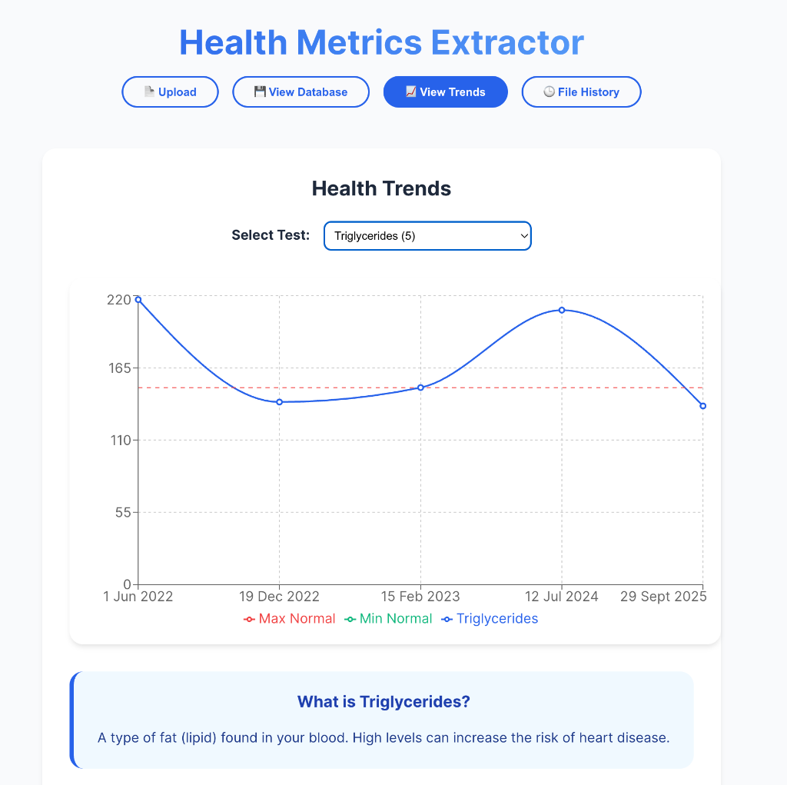

# Health Metrics Local Extractor

A private, offline-first web application that extracts health metrics from PDF medical reports using a local LLM (Mistral-7B). It parses, stores, and visualizes your health data trends without ever sending your sensitive documents to the cloud.



## Features

### Core
*   **Offline & Private**: All processing happens locally on your machine. No data leaves your computer.
*   **PDF & Image Extraction**: Upload PDF medical reports or Images (`.jpg`, `.png`, `.webp`) to extract structured data (Test Name, Value, Unit, Reference Range, Date).
*   **Dynamic Model Selection**: Hot-swap between different LLM models (e.g., Llama 3.1, Mistral) directly from the UI dropdown without restarting.
*   **Fitness & Body Composition**: Specifically tuned to extract values from gym machines like InBody (Weight, BMI, Muscle %, Fat %, Hydration %, BMR).
*   **Mobile Access Ready**: View your health dashboard securely on your phone via your local Wi-Fi network.
*   **OCR Support**: Enhanced multi-pass OCR with image preprocessing for handling complex graphical layouts and sparse text.
*   **Smart Date Extraction**: Automatically extracts report dates from text, with a fallback to the filename if a date pattern is detected in the file title.

### Data Quality & Normalization  
*   **Test Name Standardization**: Merges variations like "Vitamin D Total", "25-OH Vitamin D" → "Vitamin D".
*   **Unit & Scale Normalization**: Standardizes units (e.g., `mg/dl` → `mg/dL`) and automatically scales **Reference Ranges** to match value conversions (e.g., `ng/mL` → `ng/dL` for Testosterone).
*   **Reference Range Cleanup**: Removes redundant units, normalizes formatting (`<200.00 mg/dL` → `<200`).
*   **Auto-fill Reference Ranges**: Missing reference ranges are automatically populated from previous readings of the same test.
*   **Anti-Hallucination**: Validates LLM output to prevent fake/invented values from being saved.

### Visualization
*   **Trend Charts**: View historical trends with interactive charts showing your values vs. normal ranges.
*   **Health Definitions**: Simple explanations for common health parameters.

## Tech Stack

*   **Backend**: Python, FastAPI, Llama.cpp, SQLite
*   **OCR**: Tesseract with Pillow/ImageFilter preprocessing
*   **Frontend**: React, Vite, Recharts
*   **Supported Models**: Llama-3.1-8B-Instruct, Mistral-7B-Instruct-v0.2 (GGUF quantized)

## Setup

### Prerequisites

*   Python 3.10+
*   Node.js & npm
*   **Tesseract OCR** (for scanned PDF support):
    ```bash
    brew install tesseract  # macOS
    ```
*   RAM: At least 8GB (16GB recommended for the LLM)

### Quick Start

The easiest way to start the app is with the included script:

```bash
./start.sh
```

This will automatically:
- Create/activate the Python virtual environment
- Install backend dependencies if needed
- Install frontend dependencies if needed  
- Start both servers

Then open **http://localhost:5173** in your browser.

> **Mobile Access:** The script now automatically runs Vite with the `--host` flag. Look at your terminal output for the `Network:` URL (e.g., `http://192.168.x.x:5173/`). You can open this specific URL on your mobile phone to view your private health dashboard remotely, as long as you are connected to the same Wi-Fi network!

> Press `Ctrl+C` to stop both servers gracefully.

---

### Manual Setup

If you prefer to run the servers separately:

### 1. Backend Setup

```bash
cd backend
uv venv
source .venv/bin/activate  # On Windows: .venv\Scripts\activate
uv pip install -r requirements.txt
```

**Download the Model:**
1.  Create a `models` directory inside `backend/`.
2.  Download `mistral-7b-instruct-v0.2.Q4_K_M.gguf` (or similar) from HuggingFace.
3.  Place it in `backend/models/`.

**Run the Backend:**
```bash
python main.py
```
The API will start at `http://localhost:8000`.

### 2. Frontend Setup

```bash
cd frontend
npm install
npm run dev
```
The UI will start at `http://localhost:5173`.

## Usage

1.  Open the frontend URL.
2.  Click "Upload PDF" and select a medical report.
3.  Watch as data is extracted in real-time.
4.  Navigate to "View Database" to see all saved records.
5.  Go to "View Trend" to visualize your health history.

## License

MIT
